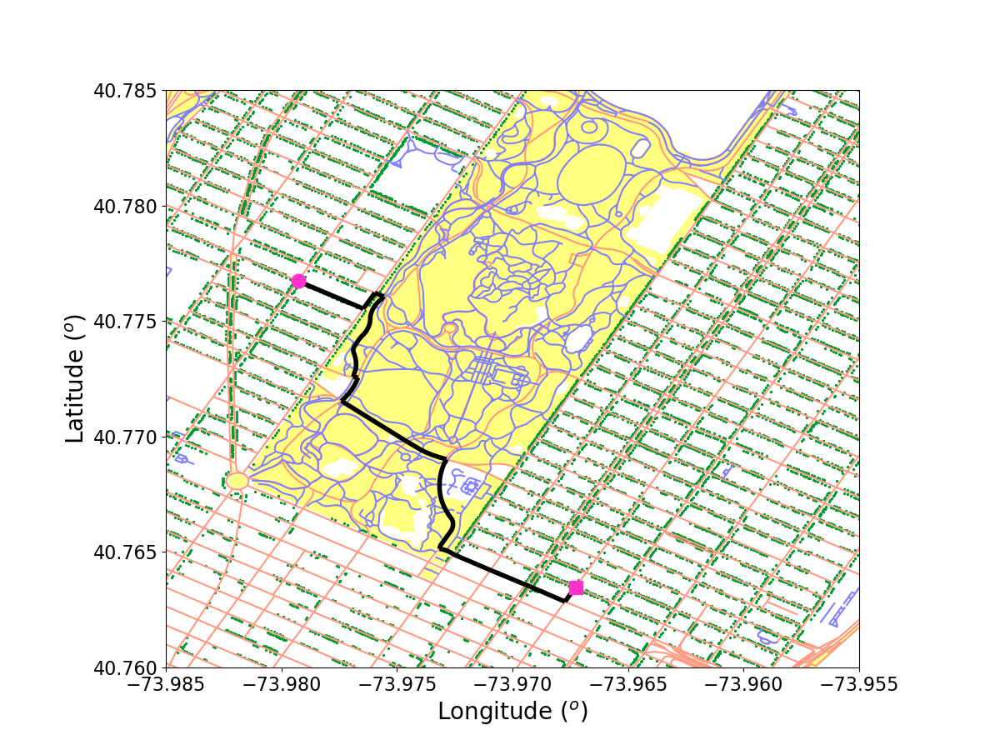

# Running Heaven: Optimize for the Most Pleasant Running Route

Running Heaven is a web-app I built in 3 weeks as an Insight Data Science Fellow in September 2018.

It uses data from the NYC Open Data website:
  * parks (https://data.cityofnewyork.us/City-Government/Parks-Zones/rjaj-zgq7)
  * streets (https://data.cityofnewyork.us/City-Government/NYC-Street-Centerline-CSCL-/exjm-f27b)
  * pedestrian roads (https://data.cityofnewyork.us/dataset/Sidewalk-Centerline/a9xv-vek9)
  * trees (https://data.cityofnewyork.us/Environment/2015-Street-Tree-Census-Tree-Data/pi5s-9p35)

I implemented a modified Dijkstra's algorithm to optimize running routes bases on the pleasantness of the route given a constraint on distance. The alogrithm favors high tree density and pedestrian routes and minimizes street intersections.

The web-app lives at http://runningheaven.space/

# To run

